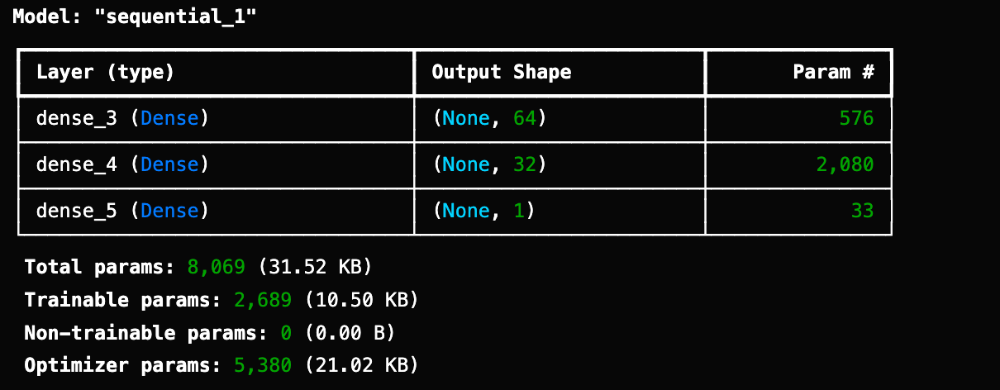
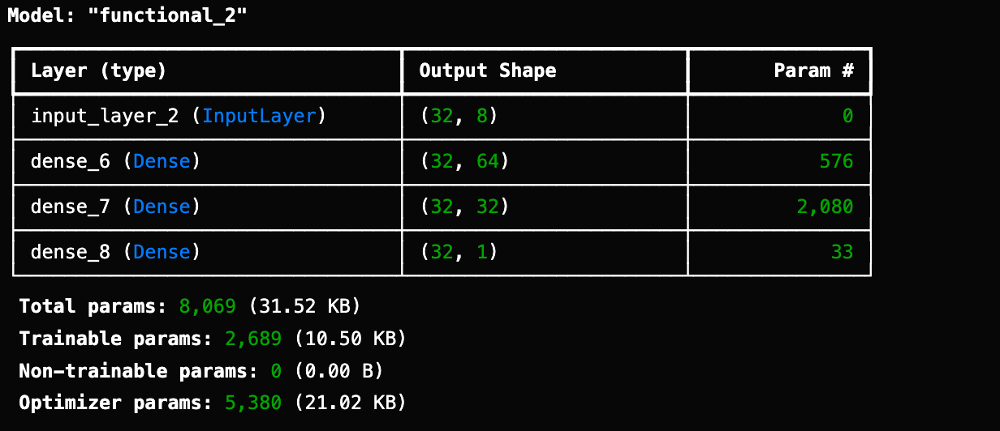

# Diabetes-Prediction-using-neural-network
I implemented diabetes prediction using Artificial Neural Networks (ANNs), utilizing both Sequential and Functional APIs in TensorFlow/Keras. This approach allowed flexibility in designing and optimizing the model architecture for accurate classification of diabetes cases.

The dataset belongs to National Institute of Diabetes and Digestive and Kidney Diseases. The Pima Indians, a Native American tribe, traditionally inhabited the Gila River region in Arizona. Known for their agricultural practices, they have faced significant health challenges, including high diabetes prevalence, in modern times. The dataset aims to predict the likelihood of diabetes in patients using specific diagnostic measurements. It focuses exclusively on females aged 21 or older of Pima Indian heritage, with carefully curated instances selected from a broader database.

## Content 
The dataset contains multiple medical predictor variables and a target variable, Outcome. Predictors include factors like the patient's number of pregnancies, BMI, insulin levels, age, and other diagnostic metrics.

## Acknowledgements
Smith, J.W., Everhart, J.E., Dickson, W.C., Knowler, W.C., & Johannes, R.S. (1988). Using the ADAP learning algorithm to forecast the onset of diabetes mellitus. In Proceedings of the Symposium on Computer Applications and Medical Care (pp. 261--265). IEEE Computer Society Press.

## Purpose of the code
Diabetes is a major global health challenge, leading to severe complications like heart attack, kidney failure, and stroke, and causing 1.6 million deaths annually. Early diagnosis is critical, yet traditional methods rely heavily on doctors' observations, which may miss hidden patterns in data. Consequently, machine learning (ML) and deep learning (DL) methods have become vital for more accurate predictions. This code is designed to predict diabetes using neural networks implemented in both Sequential and Functional APIs in TensorFlow/Keras. The Sequential API model achieved an accuracy of 78.57%, while the Functional API model reached 75.97%. This comparison highlights the effectiveness and flexibility of neural network architectures for healthcare predictions.

## Sequential API
Sequential API allows you to create models layer-by-layer by stacking them. It is limited in that it does not allow you to create models that share layers or have multiple inputs or outputs.

### Sequential Model Summary

## Functional API
Keras functional API provides a more flexibility as you can easily defines models where layers connect to more than just the previous and next layers, and you can connect layers to any other layers. As a result, you can create complex network such as Residual Network.

### Functional Model Summary

